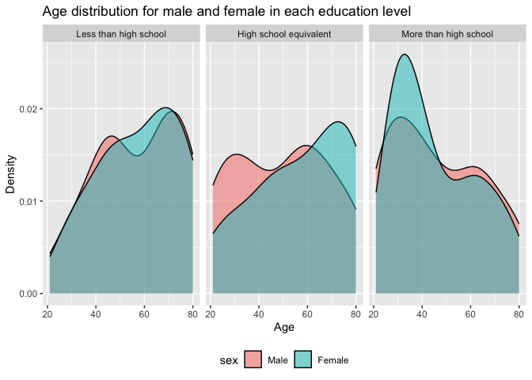
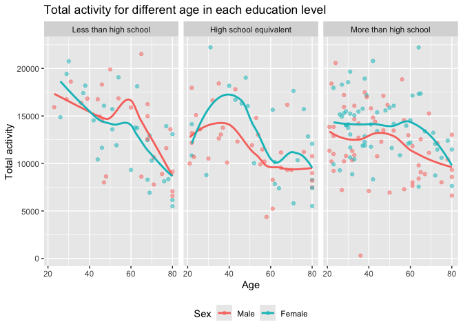

p8105_hw3_zg2486
================
2024-10-07

# Problem 1

1.  Import dataset.

``` r
library(p8105.datasets)
data("ny_noaa")

nrow(ny_noaa)
```

    ## [1] 2595176

``` r
ncol(ny_noaa)
```

    ## [1] 7

There are 2595176 observations and 7 variables in the dateset.The
variables include `id`, `date`, `prcp`, `snow`, `snwd`, `tmax`, `tmin`.
We can see lots of tmax and tmin data is missing and some prcp, snow,
snwd data are missing as well.

2.  Data cleaning.

``` r
str(ny_noaa)
```

    ## tibble [2,595,176 × 7] (S3: tbl_df/tbl/data.frame)
    ##  $ id  : chr [1:2595176] "US1NYAB0001" "US1NYAB0001" "US1NYAB0001" "US1NYAB0001" ...
    ##  $ date: Date[1:2595176], format: "2007-11-01" "2007-11-02" ...
    ##  $ prcp: int [1:2595176] NA NA NA NA NA NA NA NA NA NA ...
    ##  $ snow: int [1:2595176] NA NA NA NA NA NA NA NA NA NA ...
    ##  $ snwd: int [1:2595176] NA NA NA NA NA NA NA NA NA NA ...
    ##  $ tmax: chr [1:2595176] NA NA NA NA ...
    ##  $ tmin: chr [1:2595176] NA NA NA NA ...
    ##  - attr(*, "spec")=
    ##   .. cols(
    ##   ..   id = col_character(),
    ##   ..   date = col_date(format = ""),
    ##   ..   prcp = col_integer(),
    ##   ..   snow = col_integer(),
    ##   ..   snwd = col_integer(),
    ##   ..   tmax = col_character(),
    ##   ..   tmin = col_character()
    ##   .. )

``` r
clean_df = ny_noaa %>% 
  janitor::clean_names() %>% 
  mutate(
    year = lubridate::year(date),
    month = lubridate::month(date),
    day = lubridate::day(date),
    prcp = prcp / 10,
    snow = snow / 10,
    snwd = snwd / 10,
    tmax = as.numeric(tmax) / 10,
    tmin = as.numeric(tmin) / 10
  )

clean_df %>% 
  count(snow, name = "n_obs") %>% 
  arrange(desc(n_obs))
```

    ## # A tibble: 282 × 2
    ##     snow   n_obs
    ##    <dbl>   <int>
    ##  1   0   2008508
    ##  2  NA    381221
    ##  3   2.5   31022
    ##  4   1.3   23095
    ##  5   5.1   18274
    ##  6   7.6   10173
    ##  7   0.8    9962
    ##  8   0.5    9748
    ##  9   3.8    9197
    ## 10   0.3    8790
    ## # ℹ 272 more rows

The most commonly observed value is 0 cm.

3.  Make a two-panel plot for average tmax.

``` r
plot_df = clean_df %>%
  filter(month %in% c(1, 7)) %>% 
  mutate(
    month = case_when(
      month == 1 ~ "January",
      month == 7 ~ "July"
    )
  ) %>% 
  group_by(year, month, id) %>% 
  summarise(mean_tmax = mean(tmax), na.rm = TRUE)
  
ggplot(plot_df, aes(x = year, y = mean_tmax, color = id)) +
  geom_point(alpha = .5) +
  geom_path() +
  facet_grid(. ~ month) +
  theme(legend.position = 'None') + 
  labs(title = "Mean monthly temperature for each station across years for January and July")
```

    ## Warning: Removed 7058 rows containing missing values or values outside the scale range
    ## (`geom_point()`).

    ## Warning: Removed 6147 rows containing missing values or values outside the scale range
    ## (`geom_path()`).

<!-- --> The
overall the mean_tmax are higher in July than in January, and we can see
a possible outlier around 1988 that the mean_tmax are below 15 Celsius.s

4.  Make a two-panel plot.

``` r
max_min = clean_df %>% 
  ggplot(aes(x = tmin, y = tmax)) +
  geom_bin2d() +
  scale_fill_viridis_c() 

snowfall = clean_df %>% 
  filter(snow > 0, snow < 100) %>% 
  ggplot(aes(x = snow, y = as.factor(year))) +
  geom_density_ridges() +
  theme(legend.position = "bottom") 

max_min + snowfall
```

    ## Warning: Removed 1136276 rows containing non-finite outside the scale range
    ## (`stat_bin2d()`).

    ## Picking joint bandwidth of 0.622

<!-- --> In
the max_min plot we see that while there is some variability, the
majority of the data cluster tightly in the center of the distribution.
In several few cases, `tmax` is less than `tmin`, which raises questions
about data recording and quality. In the snowfall plot, we see a
multimodal density of snowfall within a given year. Most stations see
between 0 and 25 mm of snow in a year.

# Problem 2

1.  Import, clean, merge data sets.

``` r
demo_df = read_csv("./data/nhanes_covar.csv",
                    na = c("NA", "", "."),
                    skip = 4,
                    show_col_types = FALSE) %>% 
  janitor::clean_names() %>% 
  filter(age >= 21) %>% 
  drop_na() %>% 
  mutate(
    sex = factor(sex, levels = c(1, 2), labels = c("Male", "Female")),
    education = factor(education, levels = c(1, 2, 3), labels = c("Less than high school", "High school equivalent", "More than high school"))) 

accel_df = read_csv("./data/nhanes_accel.csv",
                    na = c("NA", "", "."), 
                    show_col_types = FALSE) %>% 
  janitor::clean_names() 

merge_df = left_join(demo_df, accel_df, by = c("seqn")) %>% 
  select(seqn, sex, age, bmi, education, everything())
```

2.  Produce a reader-friendly table and plot.

``` r
merge_df %>% 
  group_by(sex, education) %>% 
  summarise(count = n()) %>% 
  pivot_wider(
     names_from = "sex",
    values_from = "count",
    values_fill = 0
  ) %>% 
  knitr::kable() 
```

| education              | Male | Female |
|:-----------------------|-----:|-------:|
| Less than high school  |   27 |     28 |
| High school equivalent |   35 |     23 |
| More than high school  |   56 |     59 |

``` r
ggplot(merge_df, aes(x = age, fill = sex)) + 
  geom_density(alpha = 0.5) +
  facet_grid(. ~ education) +
  theme(legend.position = "bottom") +
  labs(
    title = "Age distribution for male and female in each education level",
    x = "Age",
    y = "Density",
    color = "Sex"
  )
```

<!-- -->
From the table and density plot, we can see even though the age
distribution of male is bimodel, the age distribution of male and female
overlap in less than high school level. For high school equivalent
level, the age distribution of male is bimodel, and the number of male
aged between 20-40 is higher than female in the same age, but the number
of female aged between 62-80 is hihger than male. For more than high
school level, female have higher density in age 22-45, while the density
is slightly lower in other age.

3.  Create total activity over the day and plot.

``` r
total_activity = merge_df %>% 
  group_by(seqn, sex, age, bmi, education) %>% 
  summarise(total_mims = sum(across(min1:min1440)))

ggplot(total_activity, aes(x = age, y = total_mims, color = sex)) +
  geom_point(alpha =.5) +
  geom_smooth(se = FALSE) +
  facet_grid(. ~ education) +
  theme(legend.position = "bottom") +
  labs(
    title = "Total activity for different age in each education level",
    x = "Age",
    y = "Total activity",
    color = "Sex"
  )
```

<!-- --> The
trends of total_activity for all female age in high school equivalent
and more than higher school groups are higher than male. But in less
than high school group, the trend of male surpass the trend of female
around 41-42 years old. And the overall trend of male and female in each
education level is decreasing with age increasing.

4.  Make a three-panel plot.

``` r
activity_time = merge_df %>% 
  pivot_longer(
    min1:min1440,
    names_to = "minute",
    names_prefix = "min",
    values_to = "mims"
  ) %>% 
  mutate(minute = as.numeric(minute))

ggplot(activity_time, aes(x = minute, y = mims, group = seqn, color = sex)) +
  geom_line(alpha = 0.3) +
  geom_smooth(aes(group = sex), se = FALSE) +
  facet_grid(. ~ education) +
  theme(legend.position = "bottom") +
  labs(
    title = "24-hour activity time courses for each education level",
    x = "Mintue",
    y = "Activity for each minute",
    color = "Sex"
  )
```

<!-- -->
Female and male have a similar trend in 24-hour mean_mims activity time
courses for each education level. For less than high school level,
female have lower mean_mims than male when minute \< 550, and female
have higher mean_mims than female when minute around 550 - 750. For high
school equivalent level, female overall have a higher mean_mims than
male, especially when minute is around 500 -1000. For more than high
school level, female overall have a higher mean_mims than male as well,
especially when minute is around 500 -1250.

# Problem 3

1.  Import, clean, and tidy data.

``` r
jan_2020_df = 
  read_csv("./data/citibike/Jan 2020 Citi.csv",
        na = c("NA", "", ".")) %>% 
  janitor::clean_names() %>% 
  mutate(month = "january") %>% 
  mutate(year = "2020") %>% 
  mutate(date = "january 2020")

jan_2024_df = 
  read_csv("./data/citibike/Jan 2024 Citi.csv",
            na = c("NA", "", ".")) %>% 
  janitor::clean_names() %>% 
  mutate(month = "january") %>% 
  mutate(year = "2024") %>% 
  mutate(date = "january 2024")

july_2020_df = 
  read.csv("./data/citibike/July 2020 Citi.csv",
            na = c("NA", "", ".")) %>% 
  janitor::clean_names() %>% 
  mutate(month = "july") %>% 
  mutate(year = "2020") %>% 
  mutate(date = "july 2020")

july_2024_df = 
  read.csv("./data/citibike/July 2024 Citi.csv",
            na = c("NA", "", ".")) %>% 
  janitor::clean_names() %>% 
  mutate(month = "july") %>% 
  mutate(year= "2024") %>% 
  mutate(date = "july 2024")

final_df = bind_rows(list(jan_2020_df, jan_2024_df, july_2020_df, july_2024_df)) 
```

2.  Create a reader-friendly table.

``` r
final_df %>% 
  group_by(date, member_casual) %>% 
  summarise(count = n()) %>% 
  pivot_wider(
    names_from = "member_casual",
    values_from = "count",
  ) %>%
  knitr::kable()
```

| date         | casual | member |
|:-------------|-------:|-------:|
| january 2020 |    984 |  11436 |
| january 2024 |   2108 |  16753 |
| july 2020    |   5637 |  15411 |
| july 2024    |  10894 |  36262 |

From the table, we can see overall most riders are member and members
have more riding than casual riders. We have more riders in July than
January, and overall more riders in 2024 than 2020.

3.  Make a table showing the 5 most popular starting stations for July
    2024.

``` r
july_2024_df %>% 
  group_by(start_station_name) %>% 
  summarise(count = n()) %>% 
  arrange(desc(count)) %>% 
  slice_head(n =5) %>% 
  knitr::kable()
```

| start_station_name       | count |
|:-------------------------|------:|
| Pier 61 at Chelsea Piers |   163 |
| University Pl & E 14 St  |   155 |
| W 21 St & 6 Ave          |   152 |
| West St & Chambers St    |   150 |
| W 31 St & 7 Ave          |   146 |

The 5 most popular starting stations for July 2024 are
`Pier 61 at Chelsea Piers`(163 counts), `University Pl & E 14 St`(155
counts), `W 21 St & 6 Ave`(152 counts), `West St & Chambers St`(150
counts), `W 31 St & 7 Ave`(146 counts).

4.  Make a plot to investigate the effects of day of the week, month,
    and year on median ride duration.

``` r
final_df %>% 
  mutate(
    weekdays = factor(weekdays, levels = c("Monday", "Tuesday", "Wednesday", "Thursday", "Friday", "Saturday", "Sunday"))
  ) %>% 
  group_by(weekdays, month, year) %>%
  summarise(median_duration = median(duration)) %>% 
  ggplot(aes(x = weekdays, y = median_duration, color = interaction(year, month))) +
  geom_line(aes(group = interaction(year, month))) + 
  facet_grid(year ~ month) +
  theme(legend.position = "bottom") +
  labs(
    title = "Median ride duration by Weekday Across Month and Year",
    x = "Weekdays",
    y = "Median ride duration",
    color = "Month - Year"
  )
```

<!-- -->
Comparing each day of the week, we can see generally there were higher
median ride duration on the weekend than weekdays, besides Sunday on
January 2024. We can also see no matter of which year, the median ride
duration in July were higher than January. Moreover, the median ride
duration were higher in 2020 compared to 2024 regardless of month.

5.  Make a figure that shows the impact of month, membership status, and
    bike type on the distribution of ride duration for 2024 data.

``` r
final_df %>% 
  filter(year == "2024") %>% 
  group_by(member_casual, year, month) %>% 
  ggplot(aes(x = member_casual, y = duration, color = interaction(month, rideable_type))) +
  geom_violin() +
  facet_grid(rideable_type ~ month) +
  theme(legend.position = "bottom") +
  labs(
    title = "Distribution of Ride Duration by Month, Membership Status, and Bike Types",
    x = "Membership Types",
    y = "Ride Duration"
  )
```

<!-- -->
From the violin plot we can see that member riders have more low ride
duration than casual riders, since the plots for member rider are wider.
When ride duration is close to 50 minutes, the violin plots in July have
wider spread than January with similar spread in other ride duration.
For bike types, we can see electric bike riders have wider spread with
low ride duration than classic bike riders.
