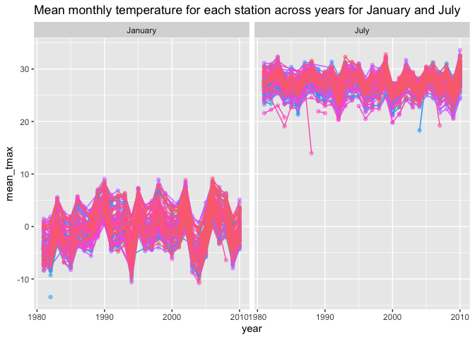
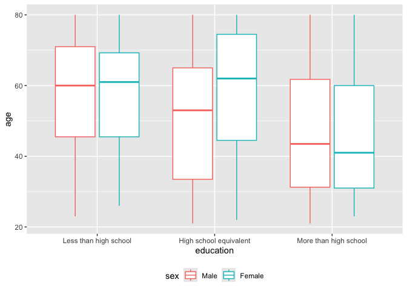

p8105_hw3_zg2486
================
2024-10-07

# Problem 1

1.  Import dataset.

``` r
library(p8105.datasets)
data("ny_noaa")

nrow(ny_noaa)
```

    ## [1] 2595176

``` r
ncol(ny_noaa)
```

    ## [1] 7

There are 2595176 observations and 7 variables in the dateset.The
variables include `id`, `date`, `prcp`, `snow`, `snwd`, `tmax`, `tmin`.
We can see lots of tmax and tmin data is missing and some prcp, snow,
snwd data are missing as well.

2.  Data cleaning.

``` r
str(ny_noaa)
```

    ## tibble [2,595,176 × 7] (S3: tbl_df/tbl/data.frame)
    ##  $ id  : chr [1:2595176] "US1NYAB0001" "US1NYAB0001" "US1NYAB0001" "US1NYAB0001" ...
    ##  $ date: Date[1:2595176], format: "2007-11-01" "2007-11-02" ...
    ##  $ prcp: int [1:2595176] NA NA NA NA NA NA NA NA NA NA ...
    ##  $ snow: int [1:2595176] NA NA NA NA NA NA NA NA NA NA ...
    ##  $ snwd: int [1:2595176] NA NA NA NA NA NA NA NA NA NA ...
    ##  $ tmax: chr [1:2595176] NA NA NA NA ...
    ##  $ tmin: chr [1:2595176] NA NA NA NA ...
    ##  - attr(*, "spec")=
    ##   .. cols(
    ##   ..   id = col_character(),
    ##   ..   date = col_date(format = ""),
    ##   ..   prcp = col_integer(),
    ##   ..   snow = col_integer(),
    ##   ..   snwd = col_integer(),
    ##   ..   tmax = col_character(),
    ##   ..   tmin = col_character()
    ##   .. )

``` r
clean_df = ny_noaa %>% 
  janitor::clean_names() %>% 
  mutate(
    year = lubridate::year(date),
    month = lubridate::month(date),
    day = lubridate::day(date),
    prcp = prcp / 10,
    snow = snow / 10,
    snwd = snwd / 10,
    tmax = as.numeric(tmax) / 10,
    tmin = as.numeric(tmin) / 10
  ) %>% 
  drop_na() 

clean_df %>% 
  count(snow, name = "n_obs") %>% 
  arrange(desc(n_obs))
```

    ## # A tibble: 248 × 2
    ##     snow   n_obs
    ##    <dbl>   <int>
    ##  1   0   1112758
    ##  2   2.5   15809
    ##  3   1.3   12460
    ##  4   5.1    9252
    ##  5   0.5    5669
    ##  6   0.8    5380
    ##  7   7.6    5296
    ##  8   0.3    5276
    ##  9   3.8    5050
    ## 10  10.2    3386
    ## # ℹ 238 more rows

The most commonly observed value is 0 cm.

3.  Make a two-panel plot for average tmax.

``` r
plot_df = clean_df %>% 
  mutate(
    year_month = lubridate::floor_date(date, unit = "month")) %>% 
  group_by(id, year_month) %>% 
  summarise(mean_tmax = mean(tmax))
  
ggplot(plot_df, aes(x = year_month, y = mean_tmax, color = id)) +
  geom_point(alpha = .5) +
  facet_grid(. ~ id)
```

<!-- -->

# Problem 2

1.  Import, clean, merge data sets.

``` r
demo_df = read_csv("./nhanes_covar.csv",
                    na = c("NA", "", "."),
                    skip = 4,
                    show_col_types = FALSE) %>% 
  janitor::clean_names() %>% 
  filter(age >= 21) %>% 
  drop_na() %>% 
  mutate(
    sex = factor(sex, levels = c(1, 2), labels = c("Male", "Female")),
    education = factor(education, levels = c(1, 2, 3), labels = c("Less than high school", "High school equivalent", "More than high school"))) 

accel_df = read_csv("./nhanes_accel.csv",
                    na = c("NA", "", "."), 
                    show_col_types = FALSE) %>% 
  janitor::clean_names() 

merge_df = left_join(demo_df, accel_df, by = c("seqn")) %>% 
  select(seqn, sex, age, bmi, education, everything())
```

2.  Produce a reader-friendly table and plot.

``` r
merge_df %>% 
  group_by(sex, education) %>% 
  summarise(count = n()) %>% 
  pivot_wider(
     names_from = "sex",
    values_from = "count",
    values_fill = 0
  ) %>% 
  knitr::kable() 
```

| education              | Male | Female |
|:-----------------------|-----:|-------:|
| Less than high school  |   27 |     28 |
| High school equivalent |   35 |     23 |
| More than high school  |   56 |     59 |

``` r
ggplot(merge_df, aes(x = education, y = age, color = sex)) + 
  geom_boxplot() 
```

<!-- -->

``` r
  # facet_grid(. ~ sex)
```

From the boxplot, we can see similar median age of more than high school
group and less than high school group, and the have similar distribution
and range, but the median age of equivalent high school group for female
is higher than male. Moreover, the overall age of have more than high
school education level will be younger than other two education levels.

3.  Create total activity over the day and plot.

``` r
total_activity = merge_df %>% 
  group_by(seqn, sex, age, bmi, education) %>% 
  summarise(total_mims = sum(across(min1:min1440)))

ggplot(total_activity, aes(x = age, y = total_mims, color = sex)) +
  geom_point(alpha =.5) +
  geom_smooth(se = FALSE) +
  facet_grid(. ~ education)
```

<!-- --> The
trends of total_activity for all female age in high school equivalent
and more than higher school groups are higher than male. But in less
than high school group, the trend of male surpass the trend of female
around 41~42 years old. And the overall trend of male and female in each
education level is decreasing with age increasing.
